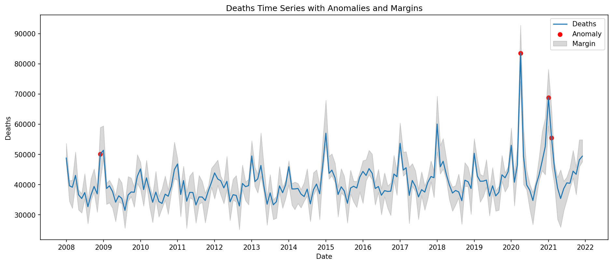

# Anomaly Detection and Visualization

This repository contains a Python script `calculate_and_graph_anomalies.py` that reads an Excel file with a time series of monthly death data, preprocesses the data, detects anomalies using the Azure Anomaly Detector API, and plots the time series with the detected anomalies and margin bands. The plot is then saved as a high-resolution PNG image.

Azure anomaly detection is part of the Azure Cognitive Services quite of tools.

## Setup Instructions

1. Install the required Python packages by running the following command:
    ```bash
    pip install openpyxl pandas matplotlib azure-ai-anomalydetector python-decouple
    ```
2. Get an API key for the Azure Anomaly Detector service by following the instructions in the next section.

3. Create a .env file in the same directory as the script and add your Azure Anomaly Detector API key and endpoint, like this:

    ```
    API_KEY=<your-api-key>
    API_ENDPOINT=<your-api-endpoint>
    ```

Replace <your-api-key> and <your-api-endpoint> with the actual API key and endpoint you obtained from Azure. (**See steps further below to get an API_KEY**)


4. Then 
    ```bash
    python calculate_and_graph_anomalies.py
    ```

And you should see a graph like this:




## Getting an API Key from Azure for Anomaly Detection

To get an API key for the Azure Anomaly Detector service, follow these steps:

a. Sign in to the Azure portal using your Microsoft account.

c. Click on "Create a resource" in the left sidebar.

d. Search for "Anomaly Detector" in the search box and select the "Anomaly Detector" service from the list of results.

e. Click the "Create" button to create a new Anomaly Detector resource.

f. Fill out the required information, such as the subscription, resource group, name, region, and pricing tier. Then click the "Review + Create" button.

g. Review your settings and click the "Create" button to create the Anomaly Detector resource.

h. Once the deployment is complete, go to the "Overview" page of the Anomaly Detector resource you just created.

i. Copy the "Endpoint" value from the "Essentials" section and add it to your .env file as the API_ENDPOINT.

j. Go to the "Keys and Endpoint" page in the left sidebar.

k. Copy one of the two available API keys and add it to your .env file as the API_KEY.

l. Now, you're ready to run the calculate_and_graph_anomalies.py script.
